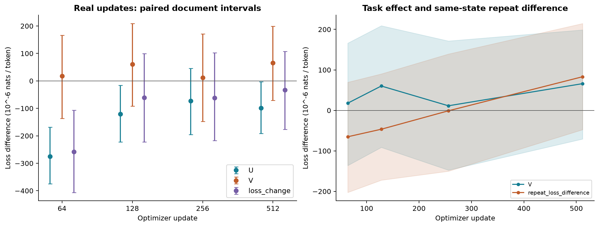
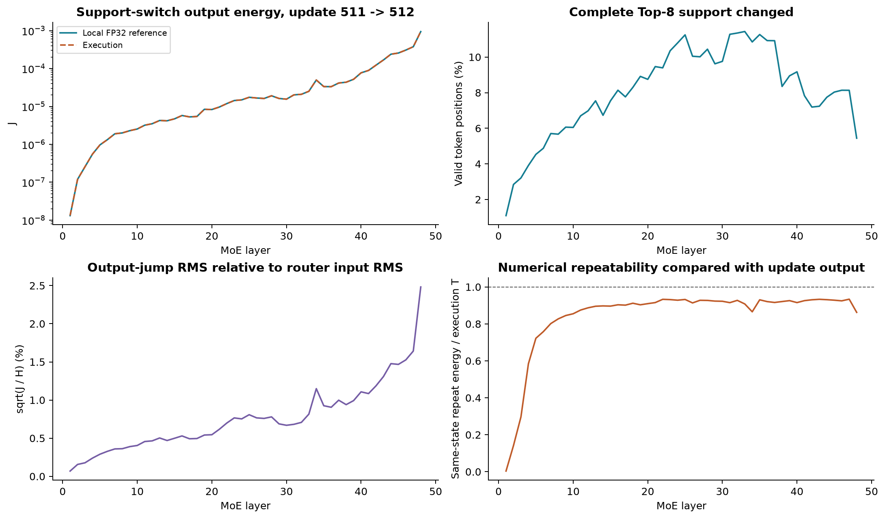
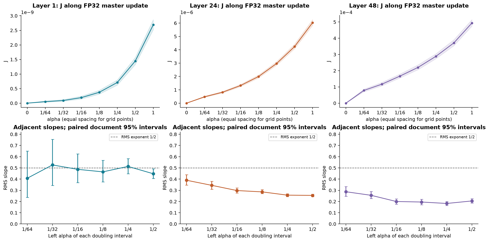

# 512 步真实更新实验的研究结论

2026-09-06；Qwen3-30B-A3B，一条 512 步全参数继续训练轨迹。这里发布科学结果摘要与聚合表，不包含集群路径、账户、调度日志或原始文本。

**存在性与首层局部尺度得到支持；核心工程损害假设没有得到支持。由于深层执行差与任务效应尚未分开，本轮也不是干净的否定结果。现有证据不足以进入新方法训练。**

训练与测量时点完成。主测量为 1,024 条序列、891,233 个有效预测位置、867 个文档组；实际有效位置少于原计划。所有损失均按有效位置计，区间为条件于本条训练轨迹的文档组输入抽样区间。

## 实际步长的任务效应

V＝新参数自然路由损失−新参数旧支持集反事实损失，单位 nats/token。

| 更新终点 | V | 95% 输入抽样区间 |
|---|---|---|
| 64 | 0.0000177623 | [−0.000136210, 0.000166046] |
| 128 | 0.0000602082 | [−0.0000913647, 0.000209098] |
| 256 | 0.0000113761 | [−0.000147533, 0.000171402] |
| 512 | 0.0000660500 | [−0.0000706280, 0.000198865] |

四个位置都跨零。独立 FP32 全网 α=1 的 V 为 0.0000537743，区间 [−0.0000116819, 0.000114523]，也跨零。第 24 层真实替换相对四个同范数随机方向平均值的配对差为 −0.0000675776，区间 [−0.000178705, 0.0000428552]。目前没有分辨出平均增损或真实方向的特殊危险性。

## 深层执行差

第 512 步，第 24、48 层的“同状态重复输出差能量 / 一次更新总输出差能量”分别约为 92.8%、86.2%；42/48 层超过 80%。这些比例不能解释为 J 的噪声占比，也不能相减得到真实更新能量。

## 首层尺度机制

对真实 FP32 更新方向的七个非零 α 点作描述性对数拟合：

| 层 | 切换概率指数 | 条件能量指数 | 路由 RMS 指数 | 其余更新 RMS 指数 |
|---|---|---|---|---|
| 1 | 0.9379 | 0.0246 | 0.4812 | 0.9994 |
| 24 | 0.5948 | 0.0082 | 0.3015 | 0.3436 |
| 48 | 0.4308 | 0.0008 | 0.2158 | 0.2701 |

J＝切换概率×条件能量。首层的平方根尺度主要来自事件发生率，支持局部机制；该拟合没有新增置信区间，也不证明工程损害。

- [48 层指数分解](alpha_exponent_decomposition.csv)
- [四次大样本全层指标](large_step_layers.csv)
- [独立复算摘要](recalculation_summary.json)
- [下一步比较的定义](../../docs/工程假设与下一步因果比较_2026-09-06.md)
- [一次更新补测的运行说明](../../docs/causal_run.md)

长期稳定性、学习率敏感性和 μP 跨宽度迁移本轮没有检验。单步没有显著增损，不能直接否定这些命题。
